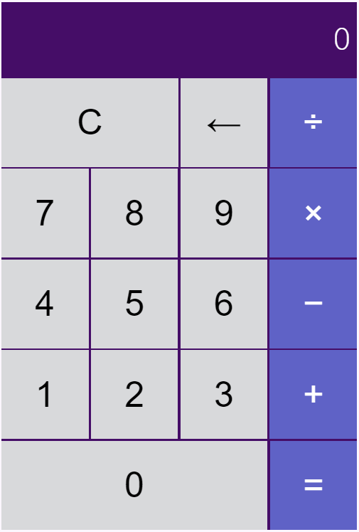

This is a simple web calculator. It can add, subtract, multiply and divide. 

This was built following the [Frontend Masters bootcamp](https://frontendmasters.github.io/bootcamp/) course and was slightly changed from what is in the course.

 
